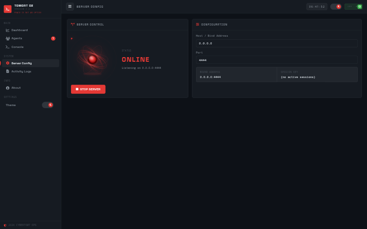
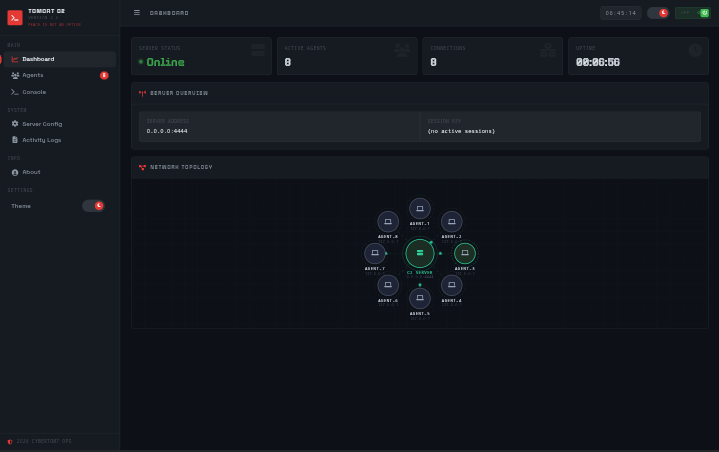
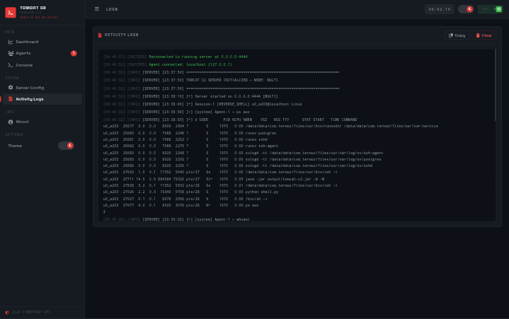
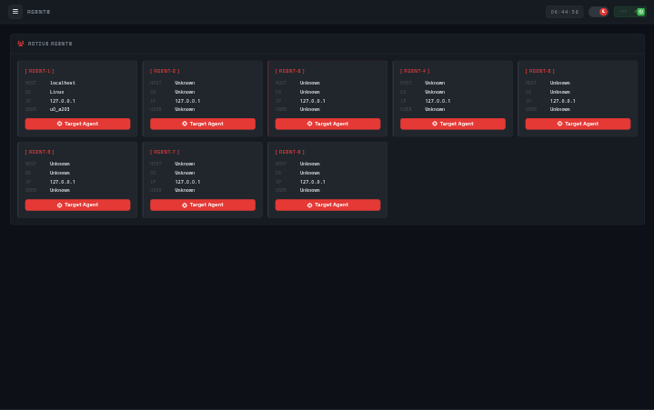
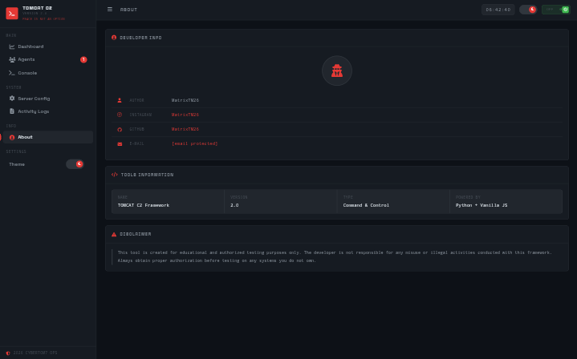
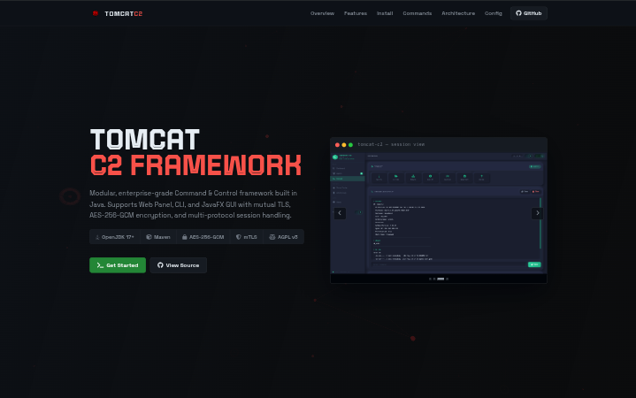

<div align="center">
    
</div>

# TOMCAT-C2-Framework


> **_Author:_** _MatrixTM26_ **_GitHub:_** _[MatrixTM26](https://github.com/MatrixTM26)_

---

##  Overview

TOMCAT C2 is a modular, enterprise-grade Command & Control framework written in Java. It supports multiple interface modes (Web, CLI, JavaFX GUI), mutual TLS authentication using PKCS12 keystores, AES-256-GCM encrypted agent communication, and multi-protocol session handling.

### WEB UI

<div align="center">
    
    <hr />
    
    <hr />
    
    <hr />
    
    <hr />
    
    <hr />
    
</div>

---

##  Features

- **Multi-Interface Support** — Web Panel (HTTP), CLI, JavaFX GUI
- **AES-256-GCM Encryption** — All agent communication is encrypted end-to-end
- **Mutual TLS (mTLS)** — Agent authentication via PKCS12 certificates
- **Multi-Protocol Sessions** — TOMCAT agents, Meterpreter, Reverse Shells
- **Certificate Manager** — Full CA, server, and agent cert lifecycle management
- **File Transfer** — Upload and download files to/from agents
- **Session Management** — Thread-safe concurrent session handling
- **Event System** — Decoupled event-driven architecture
- **Cross-Platform** — Runs on Windows, Linux, macOS via JVM
- **Configurable** — All settings via `server.properties`

---

##  Installation & Usage

### 1. Clone the Repository

- MAIN
    > For normal usage, clone branch main

```bash
git clone --branch main https://github.com/MatrixTM26/TOMCAT-C2-Framework
cd TOMCAT-C2-Framework
```

- DEV
    > For contribution commit, pull request and development, push to branch dev

```bash
git clone --branch dev https://github.com/MatrixTM26/TOMCAT-C2-Framework
cd TOMCAT-C2-Framework
```

- MASTER
    > Only for owner/admin commit, pull request and development

### 2. Build the Project

#### Ready to use (Already compiled)

> Ready to use build (created by github action and ready to run file). located at `output/tomcat-c2.jar`

```bash
java -jar output/tomcat-c2.jar
```

[](https://github.com/MatrixTM26/TOMCAT-C2-Framework/releases/latest/download/tomcat-c2.jar)

#### Manual compile

> General Build

```bash
mvn clean package -q
```

> Specific Build

- **Linux & Termux**

    ```bash
    mvn clean package -Djavafx.platform=linux -q
    ```

- **Windows**

    ```bash
    mvn clean package -Djavafx.platform=windows -q
    ```

- **MacOS**

    ```bash
    mvn clean package -Djavafx.platform=macos -q
    ```

- **BSD**
    ```bash
    mvn clean package -Djavafx.platform=openbsd -q
    ```

### 3. Run the Server

```bash
# Web Panel Mode (Default)
java -jar target/tomcat-c2.jar

# CLI Mode
java -jar target/tomcat-c2.jar -C

# JavaFX GUI Mode
java -jar target/tomcat-c2.jar -G
```

---

##  Certificate Management (MTLS)

### Initialize CA and Server Certificate

```bash
java -jar target/tomcat-c2.jar --init-certs
```

### Generate Agent Certificates

```bash
# Single Agent
java -jar target/tomcat-c2.jar \
  -a myagent -ah 192.168.1.10 -ap 4444 -am

# Multiple Agents
java -jar target/tomcat-c2.jar \
  -m -c 10 -u team -ah 192.168.1.10 -ap 4444 -am
```

---

##  Command Line Arguments

| Option                  | Description                               |
| ----------------------- | ----------------------------------------- |
| `-S, --host <addr>`     | C2 server bind address (default: 0.0.0.0) |
| `-p, --port <port>`     | Web panel port (default: 5000)            |
| `-T, --mtls`            | Enable Mutual TLS authentication          |
| `-M, --meterpreter`     | Enable multi-protocol mode                |
| `-C, --cli-mode`        | Start in CLI interface mode               |
| `-G, --gui-mode`        | Start in JavaFX GUI mode                  |
| `--init-certs`          | Initialize CA and server certificates     |
| `-a, --gen-agent <id>`  | Generate single agent certificate         |
| `-m, --gen-multi-agent` | Generate multiple agent certificates      |
| `-l, --list-agents`     | List all generated agents                 |

---

##  Interface Modes

- **Web Panel** — Access via browser at `http://localhost:5000`
- **CLI Mode** — Powerful terminal interface (`-C`)
- **JavaFX GUI** — Full desktop application with sidebar navigation (`-G`)

---

##  Security Features

- **AES-256-GCM** encryption for all agent communication
- **Mutual TLS (mTLS)** with PKCS12 keystores
- Full certificate lifecycle management (CA → Server → Agent)

---

##  Documentation

- **Open:** [Sites](https://matrixtm26.github.io/TOMCAT-C2-Framework)

##  Credit

- **Author:** [@MatrixTM26](https://github.com/MatrixTM26)
- **License:** [AGPL-V3](./LICENSE)

##  Support Me

[](https://ko-fi.com/MatrixTM26)
[](https://trakteer.id/MatrixTM26)
[](https://paypal.me/TeukuMaulana)

---

<p align="center">Copyright &copy;2023-2026 MatrixTM26 &middot; All Rights Reserved</p>
